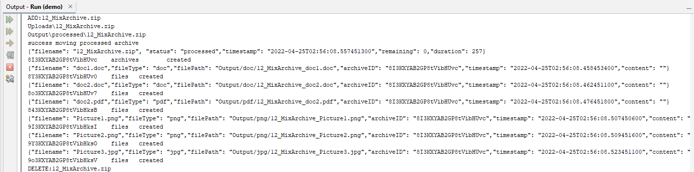
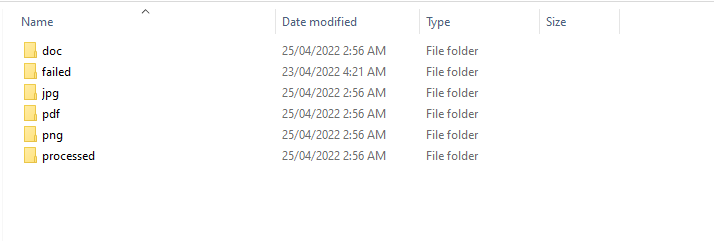
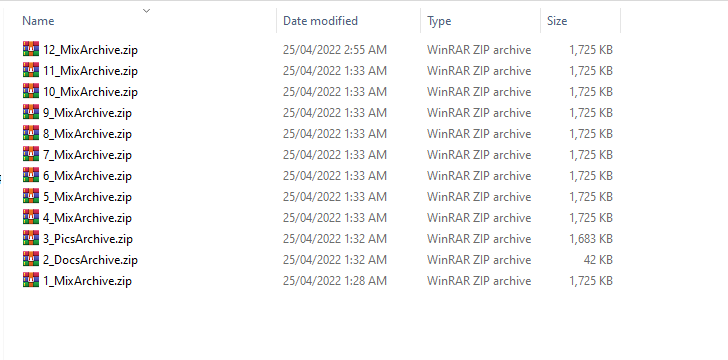
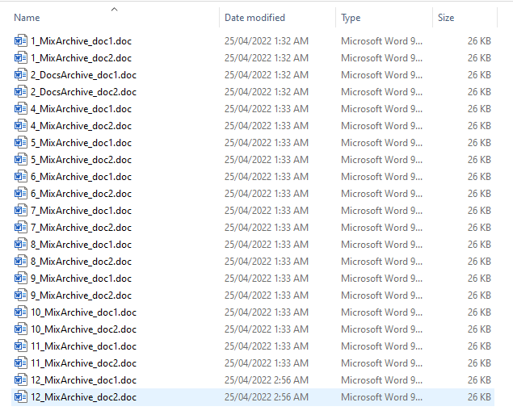

# Technical Task Elasticsearch
## Project Files
Here is the breakdown of the project directory:
* **Kibana Dashboard:** Contains exported Kibana Dashboard and screenshots
* **Output:** Preconfigured Storage Folder
* **Uploads:** Preconfigured Input Folder
* **src:** project source files
	* **Controllers:** Contains the UploadController with the exposed upload API
	* **Elasticsearch:** Contains index json files and a class to handle document indexing
	* **Models:** Contains classes to represent the Archive and File objects. Also contains Upload API response class.
	* **ApplicationConfig:** Configuration Class
	* **FileProcessor:** class used for the processing of archives
	* **MyFileChangeListener:** Listener for changes on the Input folder
	* **StorageService:** Service class for handling the storage of files passed in the API

## Screenshots

### File Processing:
Output:

Storage Folder:

Processed Folder:

Extracted Doc Files:

### Kibana Dashboard:
Archives Statistics:

Files Statistics:

