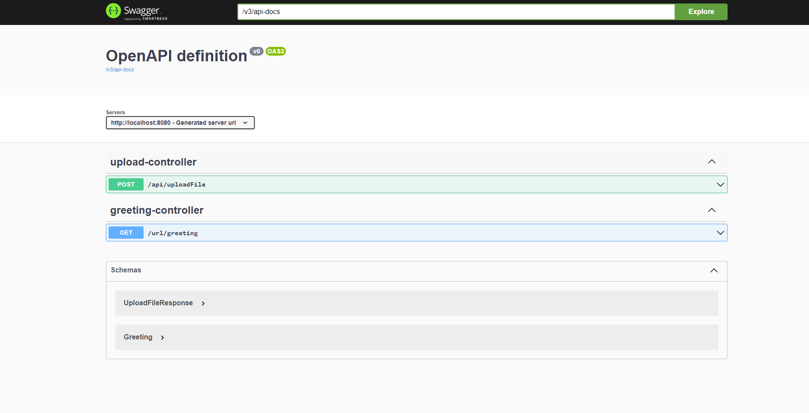

# Technical Task Elasticsearch

## API
The API endpoint is /api/uploadFile.
This accepts a POST request with a file in the body.

The swagger documentation url is /docs.html

The greetings api was just did added to test the Spring Boot REST API setup.

## Project Files
Here is the breakdown of the project directory:
* **Kibana Dashboard:** Contains exported Kibana Dashboard and screenshots
* **Output:** Preconfigured Storage Folder
* **Uploads:** Preconfigured Input Folder
* **src:** project source files
	* **main/java/com/example/demo**
		* **Controllers:** Contains the UploadController with the exposed upload API
		* **Elasticsearch:** Contains index json files and a class to handle document indexing
		* **Models:** Contains classes to represent the Archive and File objects. Also contains Upload API response class.
		* **ApplicationConfig:** Configuration Class
		* **FileProcessor:** class used for the processing of archives
		* **MyFileChangeListener:** Listener for changes on the Input folder
		* **StorageService:** Service class for handling the storage of files passed in the API
	* **main/resources**
		* application.properties

## Screenshots

### File Processing:
Output:

Storage Folder:

Processed Folder:

Extracted Doc Files:

### Kibana Dashboard:
Archives Statistics:

Files Statistics:

